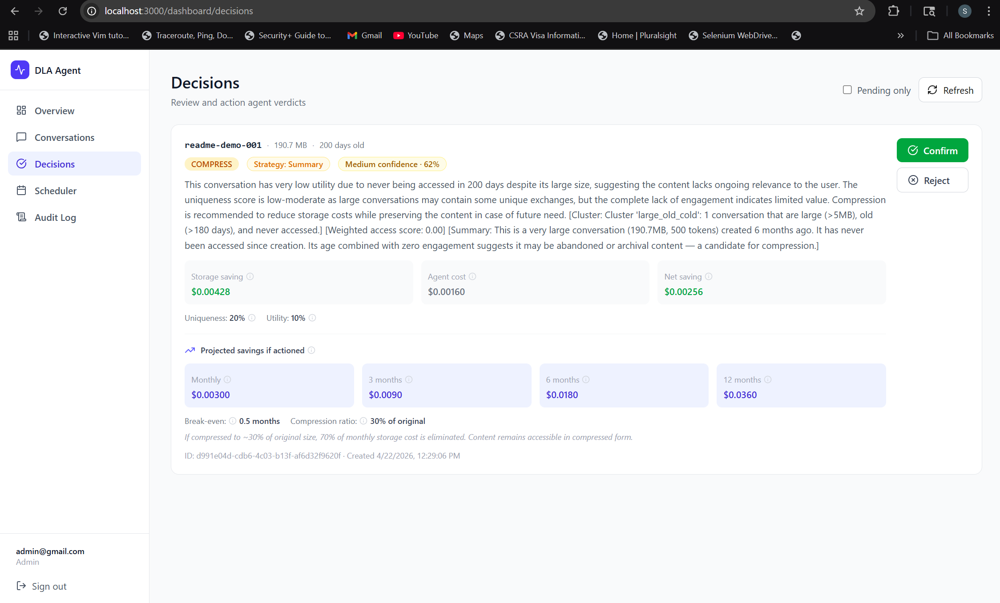
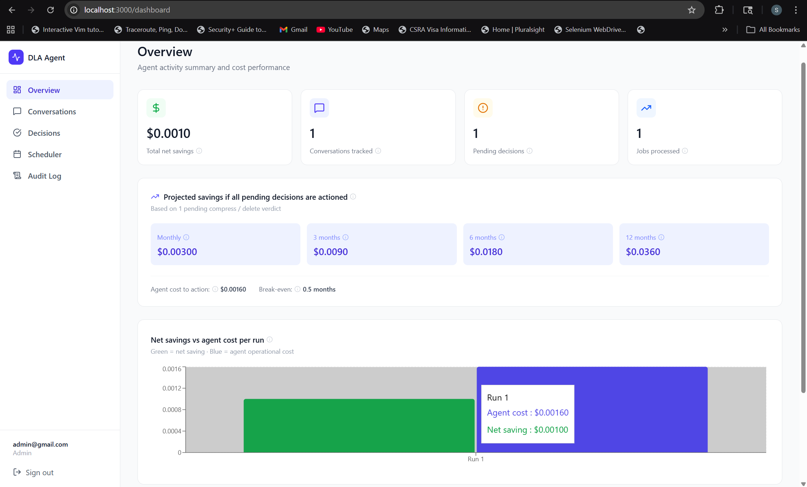

# Data Lifecycle Agent (DLA)

> An AI agent that cuts LLM conversation storage costs — and knows when it shouldn't run at all.

**Jump to:** [Why this exists](#why-this-exists) · [The core insight](#the-core-insight) · [Architecture](#architecture) · [Tech stack](#tech-stack) · [Key design decisions](#key-design-decisions) · [A few bugs worth telling you about](#a-few-bugs-worth-telling-you-about) · [What this project demonstrates](#what-this-project-demonstrates) · [Running locally](#running-locally) · [Project structure](#project-structure) · [Roadmap and known limitations](#roadmap-and-known-limitations)

---

## A note on how this was built

This project was built collaboratively with Claude (Anthropic's AI assistant). I designed the system, made the architectural decisions, ran the tests, debugged the problems, and drove every iteration. Claude wrote most of the code based on that direction.

I'm calling this out upfront because I think honesty matters more than posturing. The skills this project demonstrates are real — product thinking, systems reasoning, debugging judgment, and the ability to work effectively with AI tools — they're just not the skill of typing every character from memory. That's a reasonable thing to value, and a reasonable thing not to. You decide.

---

## Why this exists

AI chat systems generate enormous volumes of conversation data that accumulates indefinitely. Most of it has no ongoing value — test interactions, one-off questions, abandoned sessions — but it continues consuming storage and incurring cost every single day.

The traditional options handle this bluntly. Keep everything forever gets expensive. Delete everything after a fixed period (30, 60, 90 days) is the standard cloud lifecycle policy, but it's structurally blind — a genuinely valuable conversation gets deleted alongside a test message because both happen to be the same age.

What's different about conversation data is that its value is **semantic**, not structural. You can't know from metadata alone whether a conversation is worth keeping — you need to understand what it's about. That's a job that LLMs can actually do well, and until recently it wouldn't have been economically feasible at scale. It still isn't, which is why the agent also has to reason about its own cost.

---

## The core insight

Instead of treating storage cost as a fixed problem and deletion as a fixed solution, the agent frames every conversation as a decision:

> **Is the cost of keeping this conversation higher than the cost of losing it — and is it worth paying for me to figure that out?**

Three things get weighed:

1. **Storage cost** — what this conversation costs to store per day, projected forward
2. **Semantic value** — how unique the content is and how useful it's likely to be later, scored by an LLM
3. **The agent's own cost** — what it will cost in API calls and compute to make this decision

If the decision cost exceeds the potential saving, the agent stands itself down rather than proceeding. Most AI agents are built to run. Designing one that's built to decide *whether* to run was the part of this project I found most interesting — and it turned out to be harder than the running itself.

---

## What a decision looks like



Each decision the agent makes is transparent: it shows the storage saving, its own operational cost, a confidence score, a human-readable reasoning from the LLM, and projected savings over 3, 6, and 12 months. Destructive actions require explicit human confirmation — the agent recommends, the human approves.

---

## Architecture

The agent runs as a scheduled job that moves conversations through a five-stage pipeline. Each stage filters aggressively so the expensive steps (API calls) only run on a small, carefully selected subset.

```
┌───────────────────────────────────────────────────────────────────────┐
│  Scheduler run triggered (manual or cron)                             │
└────────────────────────────────────┬──────────────────────────────────┘
│
▼
┌───────────────────────────────────────────────────────────────────────┐
│  STAGE 1 — Metadata summary generation                                │
│  Build a cheap text description of each conversation from its         │
│  existing metadata, and compute a recency-weighted access score.      │
│  Zero API cost.                                                       │
└────────────────────────────────────┬──────────────────────────────────┘
│
▼
┌───────────────────────────────────────────────────────────────────────┐
│  STAGE 2 — Heuristic pre-screen                                       │
│  Rule-based filter using the Stage 1 access score: recently accessed, │
│  too new, too small, or flagged for safety → classified as KEEP at    │
│  zero cost.                                                           │
└────────────────────────────────────┬──────────────────────────────────┘
│
▼
┌───────────────────────────────────────────────────────────────────────┐
│  STAGE 3 — Clustering                                                 │
│  Similar remaining conversations are grouped. One representative      │
│  per cluster will be scored, and its verdict applies to all members.  │
└────────────────────────────────────┬──────────────────────────────────┘
│
▼
┌───────────────────────────────────────────────────────────────────────┐
│  STAGE 4 — Batch gate (the economic check)                            │
│  Calculate total storage saving (from exact size_bytes) vs total      │
│  estimated agent cost across all clusters. If cost > saving, the      │
│  agent stands down entirely.                                          │
└────────────────────────────────────┬──────────────────────────────────┘
│
▼
┌───────────────────────────────────────────────────────────────────────┐
│  STAGE 5 — Semantic scoring (the only paid step)                      │
│  Cluster representatives scored by Claude for uniqueness and          │
│  utility. Verdict applied to all cluster members.                     │
└────────────────────────────────────┬──────────────────────────────────┘
│
▼
┌───────────────────────────────────────────────────────────────────────┐
│  Verdict + confidence + reasoning written to DB.                      │
│  Destructive actions require human confirmation.                      │
└───────────────────────────────────────────────────────────────────────┘
```

The point of this shape is that most conversations never reach Stage 5. Stage 2 filters out things that are obviously worth keeping. Stage 4 protects against running Stage 5 when the economics don't justify it. By the time Claude actually gets called, the candidates have been narrowed from "every conversation in the database" to "a handful of representatives from clusters that might actually yield savings."

Here's how the savings show up once decisions have been actioned:



---

## Tech stack

| Layer | Technology | Why |
|---|---|---|
| **Backend** | FastAPI (async Python) | Async I/O matters — the pipeline does parallel API scoring with `asyncio.gather()` and concurrent DB reads. FastAPI's native async support made this clean. |
| **Database** | PostgreSQL 18 | Needed transactional integrity for verdicts, audit logs, and rollback windows. Postgres also supports the timezone-aware timestamps the scheduler depends on. |
| **Frontend** | Next.js 14 + TypeScript | Client-side rendered dashboard with interactive filtering and real-time data fetching from the FastAPI backend. |
| **LLM provider** | Anthropic Claude Sonnet | Used for semantic scoring of conversation value (uniqueness and utility), accessed through the Anthropic API. |
| **Scheduler** | FastAPI `BackgroundTasks` | Runs the pipeline in-process after the API returns a response. Deliberately chose this over Celery+Redis for simpler local development — production would need a proper distributed queue. |
| **Clustering** | Pure Python (bucket-based metadata clustering) | Conversations grouped into discrete buckets by size, age, and recency-weighted engagement. One representative per cluster is scored, saving N-1 API calls per group. Skipped embeddings and similarity math because the metadata is already structured — buckets are fast, interpretable, and good enough. |
| **Authentication** | JWT (HS256) | Standard for single-tenant apps. Would move to OAuth2 for multi-tenant. |

---

## Key design decisions

A few of the most interesting calls I made. Each one had a different option I considered and rejected.

### The agent reasons about its own cost

Most cost-optimization tools assume the tool itself is free. That's fine for things like cloud lifecycle policies that run as cheap database queries — but an LLM-powered agent's operational cost is real. Each API call costs money. If the agent runs blindly on every conversation, there are conversations where its own cost exceeds any possible saving. On those, it's actively destroying value.

The batch gate in Stage 4 prevents this. Before any paid API calls happen, the agent calculates whether running the batch will save more money than it costs — and stands down if the answer is no. The check is done at the batch level rather than per-conversation, so one large conversation with meaningful savings can justify the cost of analysing several smaller ones in the same run. That reflects how operational costs actually work.

**Tradeoff:** the gate depends on an accurate *estimate* of the agent's cost before it runs. Getting that estimate wrong — which I did at first — either makes the agent too cautious or too aggressive. That's the first of the bug stories below.

### Heuristic pre-screen before any API call

Stage 2 filters out conversations that are obviously worth keeping — recently accessed, very small, highly engaged, or safety-flagged — using simple rule-based logic at zero cost. Only genuine candidates make it to the expensive semantic scoring step.

This was a deliberate choice to push easy decisions to the cheap layer. If a conversation was accessed yesterday, I don't need Claude to tell me to keep it. A rule does the job.

**Tradeoff:** the heuristic has to be conservative — it should err on the side of keeping, never deleting. A bug in the heuristic that caused it to skip the API call and accidentally compress something valuable would be much worse than one that sent too many conversations to the API. I biased the thresholds accordingly.

### Conversation clustering to reduce API calls

The naive approach is to score every conversation individually. That would scale API cost linearly with conversation count — 10,000 conversations means 10,000 API calls.

Instead, conversations get grouped into clusters by size, age, and recency-weighted engagement. Only one representative per cluster gets scored, and the verdict applies to every member. In a batch of 50 conversations forming 10 clusters, that's 10 API calls instead of 50.

**Tradeoff:** we lose fidelity. If a cluster contains one valuable conversation hidden among 49 similar-looking worthless ones, the verdict might be wrong for that one. I accepted this because (a) the safety pre-screen catches most genuinely valuable conversations before clustering, and (b) destructive actions require human confirmation before anything actually happens.

### Recency-weighted access scoring instead of raw access count

Raw access count treats a conversation accessed 10 times two years ago the same as one accessed 10 times last week. That's clearly wrong — recent engagement is a much stronger signal of value than historical engagement.

The system uses an exponential decay function (λ=0.01) to weight recent accesses more heavily. An access yesterday counts roughly 1.0; an access 30 days ago counts 0.74; 180 days ago, 0.17; a year ago, 0.03. The weighted score feeds into both the heuristic pre-screen and the final scoring prompt.

**Tradeoff:** the decay rate is a tuned constant, not derived from data. In production you'd probably want to learn λ from observed access patterns over time. For a prototype, a sensible default is good enough.

### Human confirmation required for all destructive actions

The agent can recommend KEEP, COMPRESS, or DELETE. For COMPRESS and DELETE, it doesn't execute — it writes the verdict to the database with `confirmation_required=true`, and a human has to click Confirm in the dashboard before anything gets touched.

Cluster membership doesn't bypass this. Even if a conversation's verdict was inherited from its cluster representative rather than individually scored, a human still has to approve before it's actioned.

I considered making this configurable — an "auto-execute if confidence > 90%" mode for trusted clusters. I rejected it. The downside of a mistake (losing a genuinely valuable conversation) is much worse than the upside of saving a click. High confidence isn't the same as certainty, and destructive data operations shouldn't depend on probabilistic judgment.

---

## A few bugs worth telling you about

These are the kind of stories I'd probably tell in an interview, so they belong here too. Three bugs that each taught me something different.

### 1. The agent refused to run on the conversations it was designed to help

After the system was running end-to-end, I ran three test cases with conversations of increasing size: 19 KB, 95 MB, and 953 MB — all old, all never accessed, all the kind of conversation the agent is designed to compress. All three came back with a STANDDOWN verdict. The agent refused to run.

| Size | Storage saving | Agent cost | Ratio |
|---|---|---|---|
| 19 KB | $0.000000 | $0.001008 | — |
| 95 MB | $0.002142 | $0.010080 | 10× |
| 953 MB | $0.021420 | $0.084000 | 84× |

The agent cost was scaling almost linearly with conversation size. That's wrong on its face — the *point* of the design is that Claude scores conversations from a short metadata summary, not the raw content. A 1 GB conversation and a 1 KB conversation should produce API calls of roughly the same size.

The bug was in the cost *estimator*, not in the actual API calls. Two lines were estimating the cost of a future API call as 25% of the conversation's token count:

```python
rep_tokens = max(int(rep.token_count * 0.25), 100)
```

Which made the estimator say "this API call will cost a lot" on any large conversation, which made the gate stand down, which meant the agent refused to analyse exactly the conversations it was designed for.

The fix was a single constant based on measuring a real API call:

```python
rep_tokens = settings.AGENT_TOKENS_PER_CALL  # 700
```

After the fix, the same 953 MB conversation produced an agent cost of $0.00158 instead of $0.084 — roughly 53× cheaper. The gate passed, the analysis ran, and the verdict was a confident COMPRESS.

**The lesson:** when a system misbehaves, the instinct is to blame the rule that fired. But the rule might be fine — the problem might be one layer earlier, in whatever produced the rule's input. The stand-down rule was correct (*"don't run if cost exceeds saving"*). The storage math was correct. The API calls themselves were cheap. What was broken was the number being fed *into* the correct rule. The system was making rational decisions from bad inputs and arriving at wrong conclusions.

### 2. The bug that wasn't telling me it was there

At one point I ran the scheduler and everything seemed to complete — no errors, no crashes, the runs showed up in the audit log as "started" and then "completed." But no verdicts were being written. The Decisions page stayed empty.

I couldn't figure out where the failure was happening, because the logs showed nothing wrong. That was the clue: I was looking for error messages, and there weren't any. Instead of asking *"what error is being thrown?"* I started asking *"what should be in the log that isn't?"* — and noticed the audit log had scheduler runs starting and completing with no verdict events in between.

The cause was a handful of `except: pass` blocks in helper functions that silently swallowed every exception, including ones that were preventing writes to the database. Replacing them with explicit error logging made the underlying bugs visible immediately.

**The lesson:** bare `except` clauses are not cautious — they're hostile. They hide the exact information you need to debug the system. Every `except` clause in this codebase now either handles a specific, expected exception or re-raises after logging.

### 3. A single wrong number that broke the whole economic model

The cost oracle has a constant for storage cost per gigabyte per day, converted from a provider's monthly rate:

```python
# Before
DEFAULT_STORAGE_COST_PER_GB_DAY = 0.023 / 1024
```

That's wrong. The monthly cost is $0.023 per GB — to convert to daily, you divide by 30, not 1024. 1024 is the bytes-to-kilobytes ratio, which has nothing to do with time. The result: every storage saving estimate was roughly 34× smaller than reality, which cascaded into the batch gate standing down conversations that should have passed it.

The fix was one character:

```python
# After
DEFAULT_STORAGE_COST_PER_GB_DAY = 0.023 / 30
```

**The lesson:** check your units. In a system where one constant multiplies through dozens of downstream calculations, a single wrong divisor can silently break the whole economic model. Internal consistency is easy to verify; external correctness is what actually matters.

---

## What this project demonstrates

- **Systems thinking** — a 5-stage pipeline designed around progressive filtering, where each stage protects the expensive ones. The architecture is the product, not an accident.
- **Economic reasoning** — every decision weighed against its own cost. The agent reasons about whether it should exist for each conversation, not just what to do with it.
- **Debugging judgment** — caught and fixed bugs at the layer where they actually lived (cost estimator, not the rule; silent failures, not the side effects), with the instinct to ask what should be true rather than just reading error messages.
- **Product sense** — transparent verdicts with reasoning, confidence scores, human confirmation for destructive actions, forecasted savings. The agent recommends; the human decides.
- **Working with AI tools effectively** — designed the system, tested behaviour, caught bugs the AI missed, and drove every iteration. The code was written in collaboration with Claude; the judgment was mine.

---

## Running locally

### Prerequisites

- Python 3.11 or newer (3.13 works with the asyncpg version pinned below)
- Node.js 18 or newer
- PostgreSQL 18
- pgAdmin 4 (or any tool that can run `.sql` files against Postgres)
- An Anthropic API key from [console.anthropic.com](https://console.anthropic.com)

### 1. Clone and set up the project root

```bash
git clone https://github.com/SandeepPalugula/data-lifecycle-agent.git
cd data-lifecycle-agent
```

**Important:** the backend is a package inside the root folder (`dla_backend`). All commands below assume you're running them from the root, not from inside `dla_backend`. Running from the wrong directory will break Python's relative imports.

### 2. Create the database

Open pgAdmin and create a new database called `data_lifecycle_agent`. Then configure its timezone:

```sql
ALTER DATABASE data_lifecycle_agent SET timezone = 'UTC';
```

This prevents PostgreSQL from storing timestamps with a local offset, which would cause the scheduler to miss newly registered conversations.

### 3. Apply the schema

Open pgAdmin's Query Tool, connect to the `data_lifecycle_agent` database, paste the contents of `db/dla_schema.sql`, and run it. The schema automatically creates the three required database roles (`dla_agent`, `dla_api`, `dla_readonly`) if they don't already exist, so no manual role creation is needed.

### 4. Set up the backend

From the **project root** (not inside `dla_backend`):

```bash
# Create a virtual environment at the root level
python -m venv venv

# Activate it
venv\Scripts\activate            # Windows
# source venv/bin/activate        # macOS / Linux

# Install dependencies
pip install -r dla_backend/requirements.txt
```

If you're on Python 3.13 and `pip install` fails on `asyncpg`, pin it explicitly:

```bash
pip install asyncpg==0.30.0
```

Create the backend environment file at the **project root** (this is the file the backend reads; there should not be a second `.env` inside `dla_backend`):

```bash
cp dla_backend/.env.example .env
```

Open `.env` and fill in:
- `DATABASE_URL` — your Postgres connection string
- `ANTHROPIC_API_KEY` — your API key
- `SECRET_KEY` — any long random string (used for signing JWT tokens)

### 5. Start the backend

From the project root:

```bash
uvicorn dla_backend.main:app --reload --port 8000
```

The backend is now running at `http://localhost:8000`. Interactive API docs are at `http://localhost:8000/docs`.

### 6. Register your first user

There are no seeded credentials — you need to register a user before you can sign in.

1. Go to `http://localhost:8000/docs`
2. Find `POST /auth/register`
3. Register an account with role `admin`

### 7. Set up and start the frontend

In a separate terminal:

```bash
cd dla_frontend
npm install
cp .env.local.example .env.local   # defaults point at http://localhost:8000
npm run dev
```

The frontend is now running at `http://localhost:3000`. Sign in with the user you just registered.

### 8. Try it out

1. Register a few test conversations via `POST /conversations` in Swagger (`http://localhost:8000/docs`)
2. Trigger a scheduler run from the Scheduler page in the dashboard
3. View verdicts on the Decisions page

### Troubleshooting

**Stale UI after frontend changes.** Delete the Next.js cache and restart:

```bash
# From dla_frontend/
rd /s /q .next           # Windows
# rm -rf .next            # macOS / Linux
npm run dev
```

**Backend can't connect to the database.** Double-check that `DATABASE_URL` in `.env` matches your Postgres setup, that the database exists, and that the three roles were created by the schema file.

**Newly registered conversations not picked up by the scheduler.** Verify the `ALTER DATABASE ... SET timezone = 'UTC'` step actually ran — a mismatched timezone will silently exclude them from the scheduler's age filter.

---

## Project structure

```
data-lifecycle-agent/
├── db/
│   ├── dla_schema.sql
│   ├── migration_p5_compression_strategy.sql
│   └── migration_r3_confidence_score.sql
│
├── dla_backend/
│   ├── init.py
│   ├── main.py                              # FastAPI app entry point
│   ├── config.py                            # Settings (env vars, thresholds)
│   ├── database.py                          # Async SQLAlchemy engine + session
│   ├── models.py                            # ORM models for all 10 tables
│   ├── auth.py                              # JWT auth + role-based access
│   ├── audit.py                             # Append-only audit log writer
│   ├── requirements.txt
│   ├── .env.example
│   │
│   ├── routers/                             # FastAPI route handlers
│   │   ├── init.py
│   │   ├── auth.py
│   │   ├── conversations.py
│   │   ├── decisions.py
│   │   ├── scheduler.py
│   │   ├── costs.py
│   │   └── audit.py
│   │
│   └── services/                            # Core agent logic
│       ├── init.py
│       ├── summarizer.py                    # Stage 1: metadata summaries
│       ├── clusterer.py                     # Stage 3: bucket-based clustering
│       ├── cost_oracle.py                   # Storage and compute cost rates
│       ├── scorer.py                        # Stage 5: Anthropic API call
│       ├── decision_engine.py               # Per-job analysis pipeline
│       └── forecaster.py                    # Savings projection
│
├── dla_frontend/                            # Next.js 14 dashboard
│   ├── app/
│   │   ├── layout.tsx
│   │   ├── page.tsx
│   │   ├── login/page.tsx
│   │   └── dashboard/
│   │       ├── layout.tsx
│   │       ├── page.tsx                     # Overview
│   │       ├── conversations/page.tsx
│   │       ├── decisions/page.tsx
│   │       ├── scheduler/page.tsx
│   │       └── audit/page.tsx
│   ├── lib/
│   │   ├── api.ts                           # Fetch wrapper + auth headers
│   │   └── store.ts                         # Auth state
│   ├── .env.local.example
│   └── package.json
│
├── venv/                                    # Python virtual environment (gitignored)
├── docs/                                    # Screenshots
├── .env                                     # Local secrets (gitignored)
├── .gitignore
├── LICENSE
└── README.md
```

---

## Roadmap and known limitations

### Known limitations

The following are things the current implementation does imperfectly, and I want to name them explicitly rather than hide them.

**Cumulative savings count KEEP and STANDDOWN runs as losses.** The Overview page sums `net_saving_usd` across every historical run. That includes KEEP verdicts (where nothing was actioned, so no actual saving or cost occurred) and STANDDOWN runs (where the agent declined to proceed). The result is a cumulative number that looks worse than reality. The fix is to filter the aggregate to only include runs that resulted in a COMPRESS or DELETE action.

**Frontend timestamps depend on PostgreSQL timezone configuration.** The application assumes timestamps are stored as UTC. If the `ALTER DATABASE ... SET timezone = 'UTC'` step in the setup instructions is skipped, scheduler runs may miss newly registered conversations, and displayed timestamps may be offset from the expected timezone.

**Clustering uses discrete buckets, not similarity scoring.** Two conversations differing by one byte in size or one day in age may land in different clusters. In practice this hasn't produced noticeably worse verdicts — the buckets are wide enough — but a proper embedding-based similarity score would be more robust.

**The fixed `AGENT_TOKENS_PER_CALL = 700` constant is a reasonable approximation, not a calibrated number.** It was chosen by observing a handful of real API calls. A production system should measure this continuously and adjust.

### Planned improvements

Things I'd build next if I kept going.

**Distributed task queue.** The scheduler currently runs in-process as a FastAPI background task. Scaffolding for Celery + Redis was written but deliberately skipped for local development. Production would benefit from true parallel processing across workers and a proper cron scheduler independent of the FastAPI server.

**Learned cost estimation.** Instead of a fixed `AGENT_TOKENS_PER_CALL` constant, the agent could record actual token usage from each API call and maintain a rolling average. The estimate would self-correct over time without manual tuning.

**Dashboard aggregate filter.** Update the Overview aggregate to sum `net_saving_usd` only across runs that produced COMPRESS or DELETE verdicts, and surface STANDDOWN and KEEP counts as separate metrics. The current cumulative number mixes three conceptually different outcomes.

**Per-user retention policies.** Currently the agent uses global thresholds (age filters, size thresholds, decay rate). The `users` table has a JSONB `settings` column that could hold per-user policy overrides, but the scheduler and decision engine don't yet read from it. A multi-tenant deployment would surface per-user or per-team policies through that field — or, if the configuration space grew, through a dedicated policies table.

**Compression quality scoring.** The P5 work introduced compression strategies but didn't implement post-compression quality checks. After compression, the system should verify that a sample of the compressed content can still answer the kinds of questions the original could, and roll back if quality drops below a threshold.

---

## Disclaimer

This is a learning project, not a production data governance product. The agent runs against a test PostgreSQL database with test conversations, not real user data. Nothing here has been audited for compliance, hardened for enterprise use, or validated at scale. Real-world deployment would require the work called out in the Roadmap section and substantially more.

## Acknowledgements

Built collaboratively with [Claude](https://claude.ai), Anthropic's AI assistant. I drove the design, testing, and debugging; Claude wrote most of the code from that direction. Both of us learned things along the way — the token-cost bug and the clustering simplification being two of the more memorable ones.

Thanks also to:
- The [Anthropic API and developer documentation](https://docs.anthropic.com) — the reason the scoring step works at all, and genuinely well-written.
- The open-source ecosystem this project rests on: FastAPI, SQLAlchemy, PostgreSQL, Next.js, and the wider Python and JavaScript communities that maintain them.